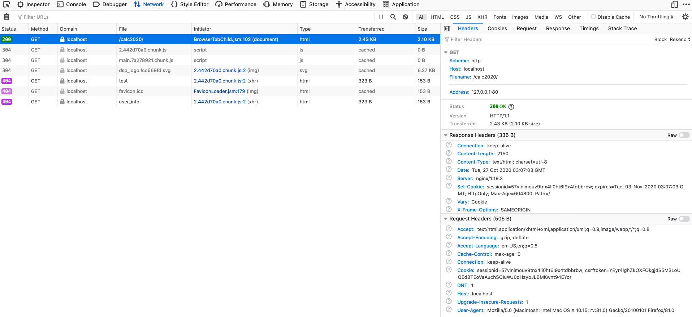
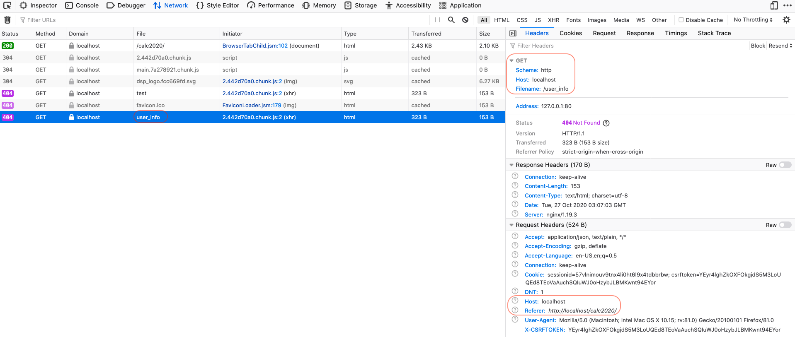

Nginx `proxy_pass`, `uwsgi_pass` 設定一直搞不定

## 最終目標
將多個服務利用 docker-compose 部署在同一個 Host 上，而且部署在非 root 上(我部署在 root 上是可以成功的)，
再利用 `Nginx proxy_pass` 將不同的 `subdirectory` 導到對應的服務，
最終架構大致如下：

```
Nginx(Host) -> 
    proxy_pass  -> APP1 -> docker-compose(Nginx + uWSGI + Django)
    proxy_pass  -> APP2 -> docker-compose(Nginx + uWSGI + Django)
```

但是我一直失敗所以我先在 Mac 上測試，並且拆解到最小單位，嘗試 `proxy_pass`, `uwsgi_pass` 依舊失敗：

```
Nginx -> proxy_pass -> APP1 -> uWSGI -> Django
```

以下是我的設定

nginx.conf

```shell
server {
    # the port your site will be served on
    listen 80;
    # the domain name it will serve for
    # substitute your machine's IP address or FQDN
    server_name _;
    charset utf-8;

    client_max_body_size 75M;   # adjust to taste


    location / {
        root   html;
        index  index.html index.htm;
    }

    location /static/ {
        alias ....../web/risk_calc/build/static/;
    }

    location /calc2020/ {
        # uwsgi_pass unix:///tmp/app.sock;
        proxy_pass http://127.0.0.1:19999/;
        proxy_set_header Host $host;
        proxy_set_header X-Real-IP $remote_addr;
        proxy_set_header X-Forwarded-For $proxy_add_x_forwarded_for;

        # include uwsgi_params;
        # uwsgi_param SCRIPT_NAME /calc2020;
        proxy_set_header SCRIPT_NAME /calc2020;
        # proxy_set_header X-Script-Name /calc2020;
    }

}
```

uwsgi.ini

```shell
[uwsgi]
# socket = /tmp/app.sock
http = :19999
module = risk_calc.wsgi:application
static-map = /static=....../web/risk_calc/build/static
master = True
processes = 4
threads = 2
vacuum = True
pidfile = /tmp/calc-master.pid

# mount = /calc2020=risk_calc.wsgi:application
# manage-script-name = true
```

以下是 Nginx 與 uWSGI 的 log files

Nginx, access.log
```
127.0.0.1 - - [27/Oct/2020:11:04:02 +0800] "GET /calc2020/ HTTP/1.1" 200 2150 "-" "Mozilla/5.0 (Macintosh; Intel Mac OS X 10.15; rv:81.0) Gecko/20100101 Firefox/81.0" "-" - 
127.0.0.1 - - [27/Oct/2020:11:04:02 +0800] "GET /user_info HTTP/1.1" 404 153 "http://localhost/calc2020/" "Mozilla/5.0 (Macintosh; Intel Mac OS X 10.15; rv:81.0) Gecko/20100101 Firefox/81.0" "-" - 
```

Nginx, error.log
```
2020/10/27 11:04:02 [error] 73645#0: *3 open() "/usr/local/Cellar/nginx/1.19.3/html/user_info" failed (2: No such file or directory), client: 127.0.0.1, server: _, request: "GET /user_info HTTP/1.1", host: "localhost", referrer: "http://localhost/calc2020/"
```

uWSGI log
```
[pid: 72737|app: 0|req: 2203/8182] 127.0.0.1 () {48 vars in 830 bytes} [Tue Oct 27 11:07:03 2020] GET / => generated 2150 bytes in 72 msecs (HTTP/1.0 200) 5 headers in 254 bytes (2 switches on core 0)
```

Browser Dev tools 的畫面

這張圖顯示我有成功將 `localhost/calc2020/` 吃到 `http://127.0.0.1:19999/` 靜態檔案，不過我猜是因為 Nginx 靜態檔案路徑有設定對，而不是成功 proxy 過去。

```    
    location /static/ {
        alias ....../web/risk_calc/build/static/;
    }
```




這張圖顯示找不到 `localhost/user_info` 這個 view's function，我預期的是他會打
`localhost/calc/2020/user_info`，且我在 browser 上直接開

- `localhost/calc/2020/user_info`
- `http://127.0.0.1:19999/user_info`

這兩隻都可以正常的回傳資訊。



## 求助

目前已經嘗試過

- Nginx -> `proxy_set_header SCRIPT_NAME`
- uWSGI -> `manage-script-name = true`

我該怎麼讓 uWSGI/Django 在打 request 保留 Nginx 所傳送過來的 `$uri`?

我不確定到底是 Nginx 還是 uWSGI 的設定出錯......
